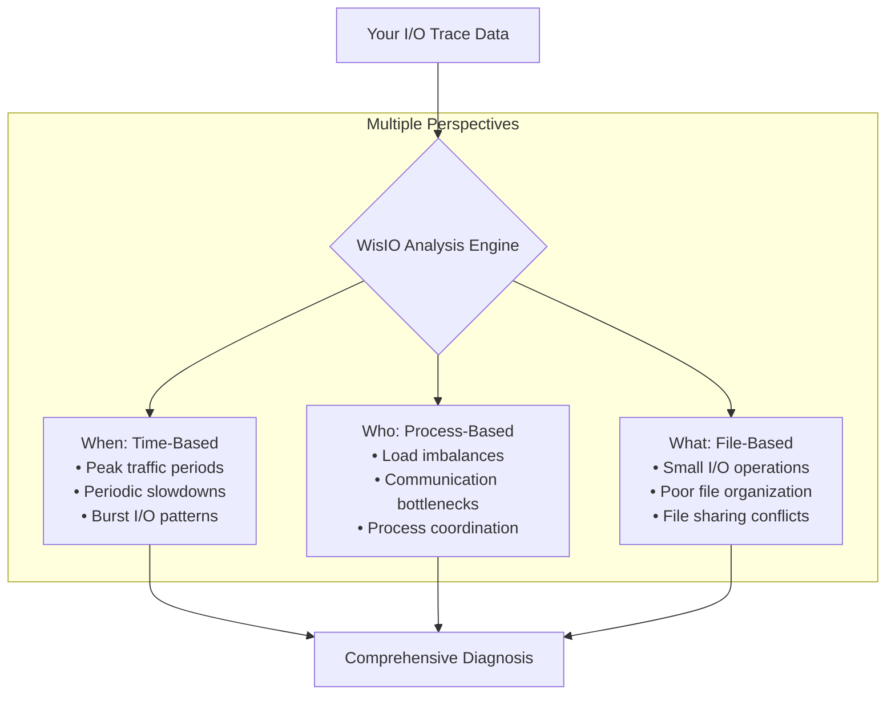
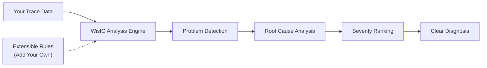

# Overview

WisIO (Wisdom from I/O Behavior) is an open-source tool that helps HPC users and system administrators identify and analyze I/O bottlenecks in their applications. By analyzing your workflow performance data, WisIO automatically detects performance issues and pinpoints their root causes through comprehensive I/O analysis.

## What WisIO Solves

As an HPC user or system administrator, you may encounter these common I/O challenges:

- **Unexplained performance degradation** during application runs with unclear causes
- **Complex I/O patterns** across distributed resources that are difficult to analyze manually
- **Large volumes of performance data** that are overwhelming to sift through
- **Hidden bottlenecks** that standard profiling tools might miss
- **Resource underutilization** due to unoptimized I/O strategies

## How WisIO Works

WisIO makes analyzing complex I/O issues simple with a straightforward workflow:

### Simple 4-Step Process

1. **Collect**: Run your HPC application with Darshan or another I/O tracer
2. **Analyze**: Feed your trace data into WisIO
3. **Review**: Examine the detailed bottleneck reports
4. **Optimize**: Apply changes to your application or system based on the analysis

The entire process is designed to be lightweight and non-intrusive to your workflow, with minimal setup required.

## Key Features

### Multi-Perspective Analysis

WisIO doesn't just look at your I/O problems from one angle - it examines them from multiple perspectives to ensure nothing is missed:

This approach finds issues that would be missed by tools that only look at a single aspect of I/O performance. For example, a bottleneck might only appear when specific processes access particular files during certain time periods - WisIO can detect these complex patterns.

### Smart Diagnostics Engine

WisIO's intelligent analysis engine doesn't just find problems - it explains them in detail:

The diagnostics engine:

- Prioritizes issues based on their impact on performance
- Provides detailed analysis of detected bottlenecks
- Explains problems in clear, human-readable language
- Allows you to add custom rules for your specific environment

### Designed for Scale

WisIO handles your data efficiently, no matter how large your workflow:

- **Fast Analysis**: Process multi-terabyte datasets in minutes rather than hours
- **Out-of-Core Processing**: Works well even on systems with limited memory
- **Parallel Processing**: Utilizes available computing resources to speed up analysis

## Who Should Use WisIO

WisIO is ideal for:

- **HPC Application Developers** looking to optimize I/O performance
- **System Administrators** trying to diagnose storage bottlenecks
- **Researchers** working with data-intensive scientific workflows

## Use Cases

Here are some common scenarios where WisIO helps users:

1. **Application Performance Analysis**: "My simulation runs slower than expected and I don't know why."
   - *WisIO identifies unbalanced I/O patterns and provides detailed diagnostics*

2. **Storage System Analysis**: "Our file system performance isn't matching the hardware specifications."
   - *WisIO reveals specific I/O patterns that impact system performance*

3. **Workflow Investigation**: "Some stages of our pipeline are much slower than others."
   - *WisIO pinpoints where and when bottlenecks occur in multi-stage workflows*

## Getting Started

Ready to analyze your I/O performance? See our [Getting Started Guide](/docs/wisio/getting-started) for:

- Installation instructions
- Basic usage examples
- Command-line interface tutorial
- Sample analysis reports
