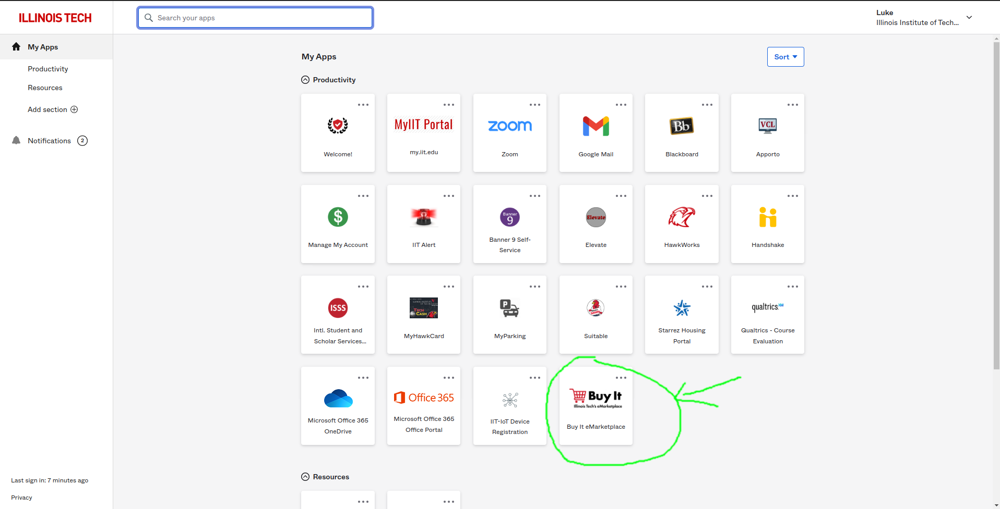
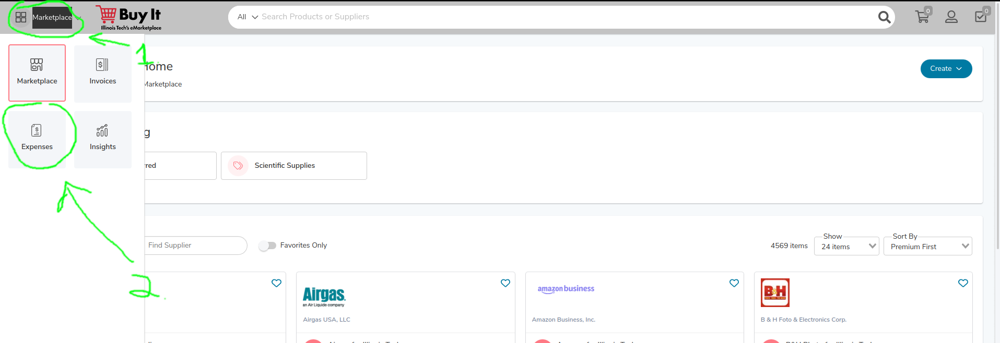
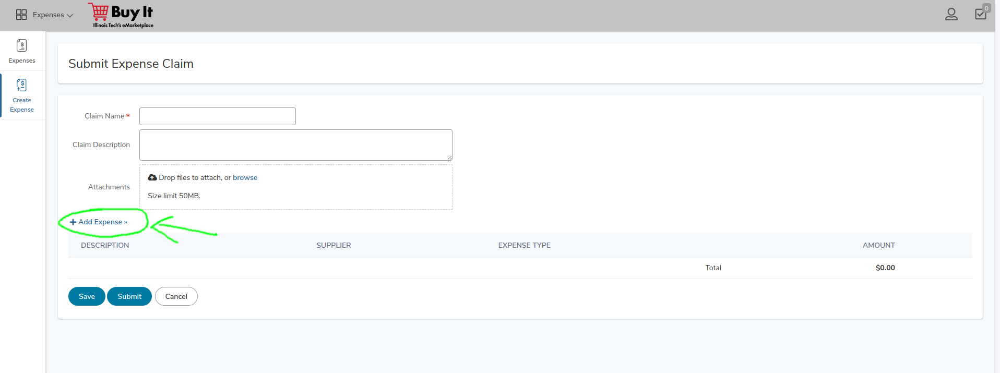
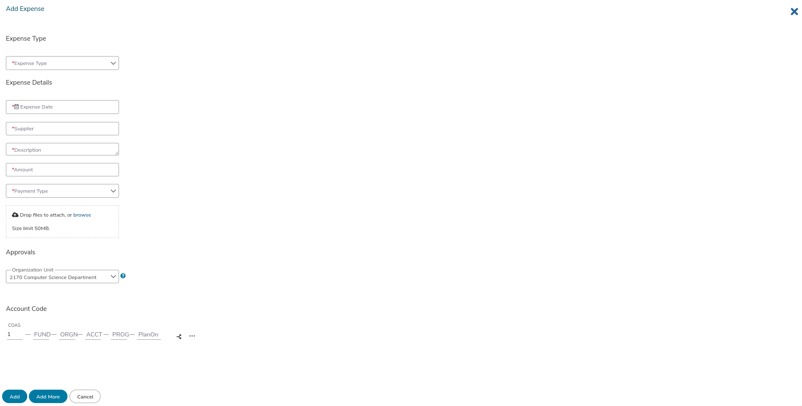
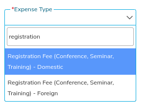
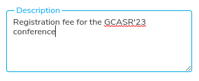

# Reimbursement

There will likely come a time when you have to purchase something on your own
credit card and then reimburse later. Generally speaking, you will be required to pay for conferences, meals, flights, hotels, etc. out-of-pocket at first, and then be reimbursed later.

The reimbursement process is arduous bureaucracy that requires receipts and good
bookkeeping. This page describes the reimbursement process you'll have to go
through for IIT. This process is intended for students. Professors and other
staff may be slightly different.

## Get to the IIT Application Portal

|  |
|:--:|
|Where to click to get to the application portal|

## Find the BuyIt App

|  |
|:--:|
|Where to click to get to the BuyIt App|

## Find the Expenses Tab

|  |
|:--:|
|Where to click to get to the expenses tab|

## Create an Expense Report

|  |
|:--:|
|Where to click to begin an expense report|

## Adding Expenses

|  |
|:--:|
|Where to click to add an expense|

## Filling in Expenses

|  |
|:--:|
|The expenses page|

There are many types of expenses. The most important are:
1. Conference Registration
2. Flight Ticket
3. Hotel/Lodging Expense
4. Meals
5. Ground Transportation (bus, train, uber, lyft, etc.)

### Account Code

The account code should be provided by your academic advisor.
Email or text them.

### Organization Unit

Generally, select 2170 Computer Science Department. 

### Payment Type

|  |
|:--:|
|conference registration expense|

If you purchased something with your personal credit card, debit card, cash,
etc., choose personally funded. This is always going to be the case,
unless there are some highly exceptional and unforseeable circumstance.

### Conference Registration

#### Expense Type

|  |
|:--:|
|conference registration expense type|

If you type the word "registration" in the Expense Type box, there will
be two options:
1. Registration Fee (Domestic): if the conference was in the USA
2. Registration Fee (Foreign): if the conference was outside of the USA.

Choose the most appropriate option.

#### Description

|  |
|:--:|
|conference registration expense|

In the description, state something like:
"Registration fee for the [CONFERENCE] conference."

#### Upload Files

You are required to prove two things:
1. You have a reason to be at the conference. To prove this, upload an image of the conference program where it shows your name and your research publication. Highlight your name and your publication.
2. You paid for the conference. To prove this, upload the receipt you got from the registration for the conference.

### Flight Ticket

### Hotel

### Ground Transportation

This includes trains, ubers, taxis, car rentals, etc.

### Meal Expenses

There are two general types of meal expenses:
1. **Per-Diems**: The "i don't want to keep receipts" options. Most grants
allow you to purchase meals without keeping receipts. An allowance is given
for breakfast, lunch, and dinner.
2. **Actuals**: The "i always keep the receipt" option. If the grant doesn't
support per-diems, then use this.

Generally, I prefer the per-diem option if it's available. It almost always is.
You don't have to upload photos for every last thing. Typically, the per diem
rates are fairly gracious. You are allowed to keep the money left over if you
don't spend the entire allocated budget.

You must ask which type you are allowed to use for the particular conference. You cannot mix and match. You either only do per-diem or actuals. If using per-diems, you must include the [GSA per-diem rate sheet as a PDF](https://www.gsa.gov/travel/plan-book/per-diem-rates). 

## Foreign Conference Considerations

1. Europe and USA have different power outlets. USA is 110V, whereas EU is 220V.
You will likely need to purchase a converter.
2. The TSA at airports can be very slow. It is recommended to arrive at the
airport 3 hours before boarding begins.
3. You should lock your checked bag with a TSA-recommended lock. It makes
your bag safer when going through the TSA.
4. It will be bad if you lose your passport while in a foreign country. Most
hotels come with a safe. You should put the passport there and take photos
of the pages with your photo and information.
5. Pick pockets are a nuissance. It is best to store your wallet in a zipped
pocket or bag. Over-the-shoulder bags are a good choice.
