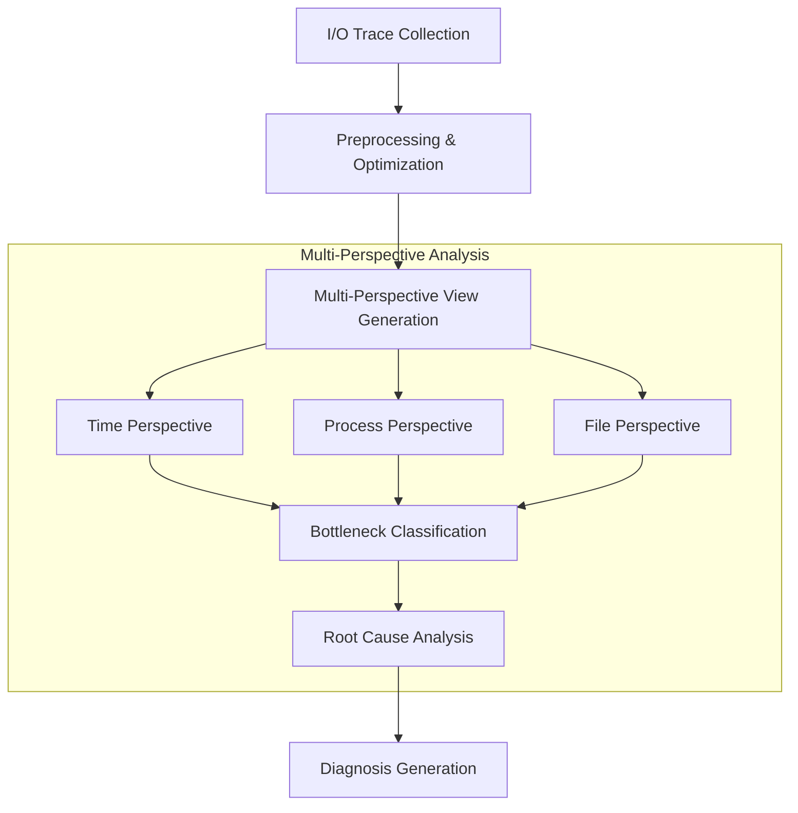
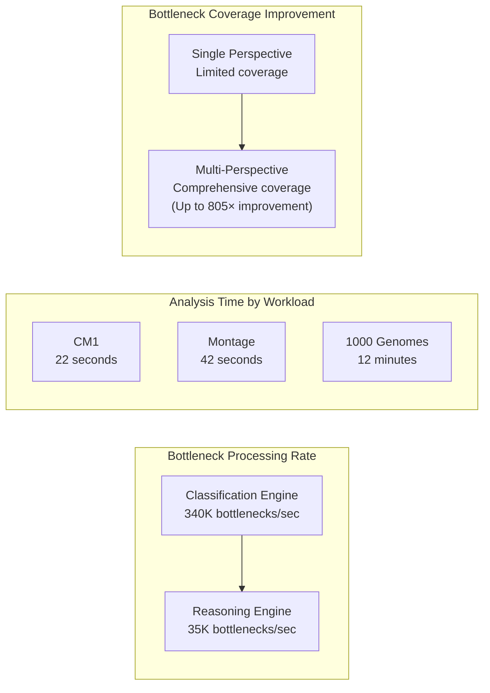

import ProjectBadges from "@site/src/components/projects/ProjectBadges";
import ProjectPublications from "@site/src/components/projects/ProjectPublications";

  

# WisIO: Automated I/O Bottleneck Detection via Multi-Perspective Views for HPC Workloads

<ProjectBadges projectId="wisio" />

## Research Overview

Modern HPC workloads are increasingly data-dependent, creating significant pressure on storage systems. With the growing diversity of storage technologies in HPC environments, the complexity of I/O systems poses substantial challenges for users and often leads to performance bottlenecks. Traditional approaches combined I/O characteristics with expert insight, while recent tools use automated performance analysis. However, the multifaceted nature of I/O problems—involving numerous metrics and complex interactions—remains challenging for both manual and automated analysis.

## Key Research Contributions

Our research on WisIO makes several significant contributions to the field of HPC I/O analysis:

1. **Multi-Perspective Analysis Framework**: We've developed a novel methodology that examines I/O traces from multiple complementary perspectives (time-based, process-based, and file-based), dramatically increasing bottleneck detection coverage by up to **805×** compared to single-perspective approaches.

2. **Intelligent Search Space Reduction**: Our approach intelligently reduces the search space within massive I/O traces, enabling efficient analysis of multi-terabyte datasets that were previously impractical to process comprehensively.

3. **Metric-Driven Classification System**: We've created a high-performance bottleneck classification system capable of processing **340,000 potential bottlenecks per second**, with a reasoning engine that can analyze **35,000 bottlenecks per second**.

4. **Extensible Rule Engine**: Our global, extensible rule engine maps I/O characteristics to potential bottlenecks and root causes, supporting domain-specific customization while maintaining high performance.

## Technical Approach

Our research methodology consists of these key phases:

1. **Data Collection & Optimization**: We capture I/O traces from HPC workloads using instrumentation tools like Darshan DXT, DFTracer, or Recorder. These traces are then optimized to enable fast distributed processing.

2. **Multi-Perspective View Generation**: Rather than analyzing I/O behavior from a single perspective, we generate multiple complementary views of the same data to capture complex interaction patterns:
   - **Time Perspective**: Analyzes temporal patterns and correlations
   - **Process Perspective**: Examines process-level behaviors and interactions
   - **File Perspective**: Evaluates file access patterns, file hierarchy relationships, and metadata operations

3. **Bottleneck Classification**: We apply metric-driven classification algorithms to each perspective to identify potential bottlenecks that might be missed when examining data from a single viewpoint.

4. **Root Cause Analysis**: Our rule engine maps identified bottlenecks to their underlying causes, drawing connections between symptoms and their sources.

5. **Diagnosis Generation**: Our system generates human-readable diagnoses explaining the detected bottlenecks and their severity, helping users understand complex I/O behavior.

## Experimental Results

Our research validated WisIO across diverse HPC workloads, demonstrating its effectiveness and performance advantages:

### Use Case: Montage (Workflow with Complex Dependencies)

We analyzed the Montage astronomical image processing workflow, which exhibits complex dependencies:

- **Scale**: 1,280 ranks performing 3.2M read and 1.6M write operations
- **Challenge**: Low average bandwidth (~3MB/s) with complex process interactions
- **Analysis Performance**: Multi-perspective analysis completed in just **42 seconds**
- **Results**: Identified **14 distinct bottlenecks** with severity scores between 52-61.4%
- **Key Finding**: Process-based analysis produced diagnoses with specific nodes or applications that would have been missed using traditional methods

### Use Case: CM1 (Simulation with Separate I/O Phases)

For the CM1 weather simulation with separate I/O phases:

- **Challenge**: 94.6% of I/O time concentrated in the first 20 seconds of execution
- **Analysis Performance**: Multi-perspective analysis completed in just **22 seconds**
- **Results**: Identified **20 distinct bottlenecks** with severity scores between 55-85%
- **Key Finding**: Time-based analysis revealed that Rank 0 was performing 100% of small file writes, creating a severe bottleneck

### Use Case: 1000 Genomes (Data-Intensive Workflow)

For the data-intensive 1000 Genomes bioinformatics workflow:

- **Scale**: Analysis of 21 million files accessed using a file-per-process pattern
- **Analysis Performance**: Despite the massive scale, multi-perspective analysis completed in only **12 minutes**
- **Results**: Identified **30 distinct bottlenecks** with severity scores between 54-67.1%
- **Key Finding**: File-based analysis produced diagnoses with specific folder hierarchies, revealing patterns that would be impossible to detect manually

## Performance Analysis

Our performance evaluation demonstrates WisIO's efficiency and effectiveness:

- **Bottleneck Processing Speed**: Our classification engine processes 340K potential bottlenecks per second, with the reasoning engine analyzing 35K bottlenecks per second
- **Analysis Time**: Even complex workloads are analyzed quickly (22-42 seconds for moderate-sized traces, 12 minutes for massive 21M-file workflow)
- **Coverage Improvement**: Multi-perspective analysis improves bottleneck detection coverage by up to 805× compared to single-perspective approaches

## Publications

<ProjectPublications projectId="wisio" />

## Broader Impact

Our research on WisIO has significant implications for the HPC community:

- **Democratizing Performance Analysis**: By automating complex I/O analysis, WisIO makes advanced performance tuning accessible to non-experts
- **Enabling Exascale Computing**: The efficient identification and resolution of I/O bottlenecks is crucial for exascale systems with increasingly complex storage hierarchies
- **Enhancing Scientific Productivity**: Reducing time spent debugging I/O issues allows researchers to focus on scientific discovery
- **Improving Resource Utilization**: Better I/O performance leads to more efficient use of expensive HPC resources

## Future Research Directions

Our ongoing and future research on WisIO includes:

- **Advanced ML-based Classification**: Incorporating machine learning to enhance bottleneck detection accuracy
- **Predictive Analysis**: Developing models to predict potential bottlenecks before they occur
- **Enhanced Bottleneck Analysis**: Developing more sophisticated analysis techniques to understand complex I/O interactions
- **Extended Hardware Support**: Adding support for emerging storage technologies and architectures
