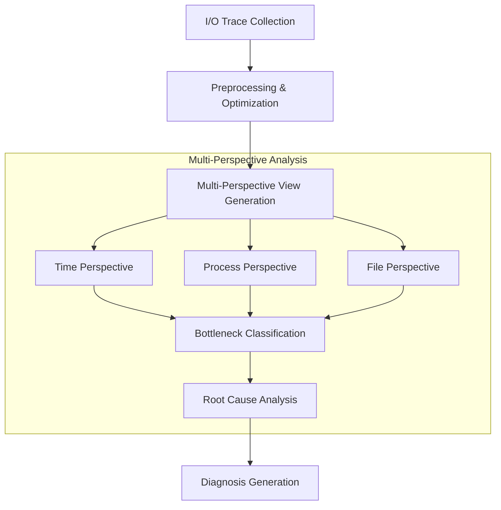
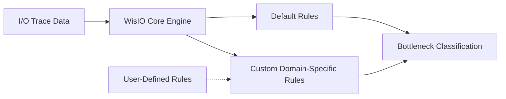

import ProjectBadges from "@site/src/components/projects/ProjectBadges";
import ProjectPublications from "@site/src/components/projects/ProjectPublications";

  

# WisIO: Automated I/O Bottleneck Detection via Multi-Perspective Views for HPC Workloads

<ProjectBadges projectId="wisio" />

## Overview

Modern HPC workloads are increasingly data-dependent, creating significant pressure on storage systems. With the growing diversity of storage technologies in HPC environments, the complexity of I/O systems poses substantial challenges for users and often leads to performance bottlenecks. Traditional approaches combined I/O characteristics with expert insight, while recent tools use automated performance analysis. However, the multifaceted nature of I/O problems—involving numerous metrics and complex interactions—remains challenging for both manual and automated analysis.

## Key Contributions

Our research on WisIO makes several significant contributions to the field of HPC I/O analysis:

1. **Multi-Perspective Analysis Framework**: We've developed a novel methodology that examines I/O traces from multiple complementary perspectives (time-based, process-based, and file-based), dramatically increasing bottleneck detection coverage by up to **805×** compared to single-perspective approaches.

2. **Intelligent Search Space Reduction**: Our approach intelligently reduces the search space within massive I/O traces, enabling efficient analysis of multi-terabyte datasets that were previously impractical to process comprehensively.

3. **Metric-Driven Classification System**: We've created a high-performance bottleneck classification system capable of processing **340,000 potential bottlenecks per second**, with a reasoning engine that can analyze **35,000 bottlenecks per second**.

4. **Extensible Rule Engine**: Our global, extensible rule engine maps I/O characteristics to potential bottlenecks and root causes, supporting domain-specific customization while maintaining high performance.

## Methodology

Our research methodology consists of these key phases:

1. **Trace Collection**: We capture I/O traces from HPC workloads using instrumentation tools like Darshan DXT, DFTracer, or Recorder.

2. **Multi-Perspective View Generation**: Rather than analyzing I/O behavior from a single perspective, we generate multiple complementary views of the same data to capture complex interaction patterns:

   - **Time Perspective**: Analyzes temporal patterns and correlations
   - **Process Perspective**: Examines process-level behaviors and interactions
   - **File Perspective**: Evaluates file access patterns and characteristics across the file system hierarchy

3. **Bottleneck Classification**: We apply a metric-driven bottleneck classification algorithm that decouples bottleneck detection from behavioral heuristics. This approach uses a severity parameter to quantify how critical each metric is for a given perspective record, enabling the identification of previously unseen bottlenecks in evolving HPC workloads.

4. **Root Cause Analysis**: Our extensible rule engine performs root cause analysis on classified bottlenecks by attaching one or more observed behaviors as reasons. The rule engine operates on identified bottlenecks using an enriched trace data to accommodate rules and reasoning conditions.

5. **Diagnosis Generation**: Our system generates human-readable diagnoses explaining the detected bottlenecks and their severity, helping users understand complex I/O behavior.

## Exemplar Results

Our research validated WisIO across diverse HPC workloads, demonstrating its effectiveness and performance advantages:

### Use Case: Montage (Workflow with Complex Dependencies)

We analyzed the Montage astronomical image processing workflow, which builds mosaics for astrophysics via 10 cooperating applications:

- **Scale**: 11.4K processes accessing 19.6K files, executing 12.3M I/O operations
- **I/O Characteristics**: 83.17% of I/O time spent on read operations, 74.85% of I/O size related to read operations
- **Analysis Performance**: Multi-perspective analysis completed in just **48 seconds**
- **Results**: Identified **495 distinct bottlenecks** with 1,735 associated reasons
- **Key Bottleneck**: Seven applications within the workflow including mImgtbl exhibit extremely small read operations (averaging 76B), leading to inefficient I/O patterns

### Use Case: CM1 (Simulation with Separate I/O Phases)

For the CM1 atmospheric simulation which simulates phenomena like thunderstorms across 193 steps:

- **Scale**: 1.2K processes accessing 775 files via 27.5K I/O operations
- **I/O Characteristics**: 85.89% of I/O time spent on metadata operations, with 86.95% of I/O operations being metadata-related
- **Analysis Performance**: Multi-perspective analysis completed in just **17 seconds**
- **Results**: Identified **75 distinct bottlenecks** with 176 associated reasons
- **Key Bottleneck**: Time-based analysis revealed that 32 ranks (first rank per node) issue "open" calls concurrently during initialization, causing stagnation on the parallel file system, while 31 ranks (except rank 0) perform only read operations

### Use Case: 1000 Genomes (Data-Intensive Workflow)

For the data-intensive 1000 Genomes bioinformatics workflow that processes human genome mutation overlaps:

- **Scale**: 2.7K processes accessing 21.2M files through 646M I/O operations
- **I/O Characteristics**: 94.04% of I/O time spent on metadata operations, despite metadata operations comprising only 16.83% of total I/O operations
- **Analysis Performance**: Despite the massive scale, multi-perspective analysis completed in **24 minutes**
- **Results**: Identified **430K distinct bottlenecks** with 560K associated reasons
- **Key Bottleneck**: Multiple root causes were identified for bottlenecks in the mutation_overlap application, which performs 1.2M I/O operations with small writes (~32KB) and spends 63% of its I/O time on metadata operations

## Enabled Practical Optimizations

WisIO's multi-perspective views enable holistic optimizations by detecting I/O bottlenecks from different views of the same trace data. Different perspectives suggest different optimization strategies:

- **File Perspective Optimizations**:

  - When many processes access the same file, data layout transformations can make parallel access more efficient
  - For frequently accessed files, caching in burst buffers or node-local storage can reduce access times
  - Hot-data policies can be implemented to place frequently accessed data in faster storage tiers

- **Process Perspective Optimizations**:

  - When a small number of processes perform the bulk of I/O operations, collective I/O can reduce requests to the storage system
  - For processes performing small, non-contiguous I/O operations, specialized file system configurations can reduce overhead

- **Timeline Perspective Optimizations**:
  - During phases of intensive I/O, collective I/O or data sieving techniques can be applied
  - When metadata operations cause bottlenecks during specific time intervals, techniques to distribute these operations across multiple servers can improve performance

## Extensibility

WisIO is designed with a modular architecture that facilitates both current functionality and future expansion:

### Extensible Perspectives

Our current implementation focuses on three core perspectives (time-based, process-based, and file-based), but the framework is designed to accommodate additional perspectives beyond these core views. WisIO allows users to dynamically specify perspectives and combine these views to create complex analysis strategies.

Potential additional perspectives include:

- **Application View**: Analyzing I/O patterns based on specific application characteristics and requirements
- **File Directory View**: Examining hierarchical patterns in file system access across directories
- **File Pattern View**: Identifying recurring access patterns across related sets of files
- **Node View**: Examining I/O behavior at the node level to identify node-specific bottlenecks
- **Host View**: Analyzing system-wide I/O patterns across different hosts in distributed environments
- **Thread View**: Investigating fine-grained I/O operations at the thread level within multi-threaded applications

### Extensible Rule Engine

WisIO's rule engine is built with extensibility as a core design principle:

Key extensibility features include:

- **Custom Rule Definition**: Users can define new rules based on their domain expertise or specific system knowledge
- **Rule Prioritization System**: The engine intelligently weighs and applies rules based on relevance and severity
- **System-Specific Rules**: Rules can be tailored to the specific characteristics of different storage architectures

This extensible design ensures that WisIO can adapt to the evolving needs of HPC environments and workloads over time.

## Publications

<ProjectPublications projectId="wisio" />

## Future Directions

Our ongoing and future research on WisIO includes:

- **Advanced ML-based Classification**: Incorporating machine learning to enhance bottleneck detection accuracy
- **Predictive Analysis**: Developing models to predict potential bottlenecks before they occur
- **Integration with I/O Middleware**: Extending WisIO's capabilities to work alongside I/O middleware libraries (like Hermes and UnifyFS) for real-time bottleneck detection and dynamic optimization
